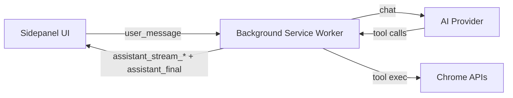
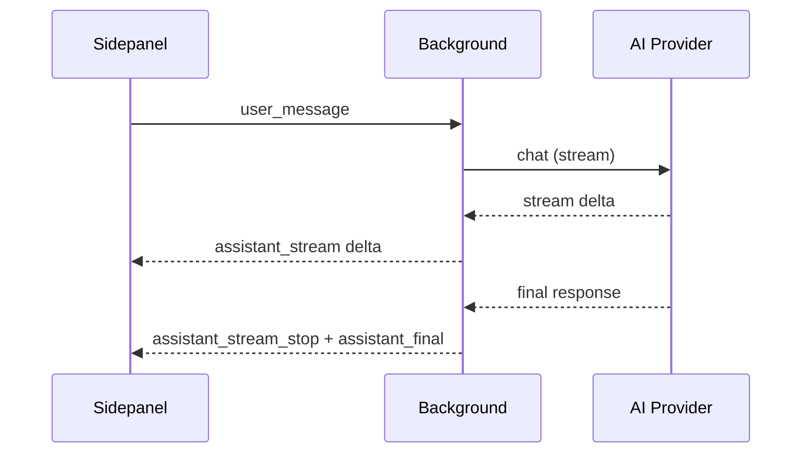

# Glide

Glide é uma extensão de navegador (Chrome) que fornece assistência de IA para automação de navegação. Combina uma interface de chat com execução de ferramentas para navegar, ler e interagir com páginas web sem sair do seu fluxo de trabalho.

## O que faz

- Automação de navegador guiada por chat com execução de ferramentas
- Timeline de chamadas de ferramentas + raciocínio durante streaming
- Histórico de sessões e configurações por perfil
- Suporte a múltiplos providers de LLM (OpenAI, Anthropic, Google, Ollama, Kimi)

## Arquitetura



## Providers Suportados

| Provider | Tipo | Endpoint Padrão |
|----------|------|-----------------|
| Anthropic (Claude) | Cloud | api.anthropic.com |
| OpenAI (GPT) | Cloud | api.openai.com |
| Google (Gemini) | Cloud | generativelanguage.googleapis.com |
| Ollama | Local | http://localhost:11434 |
| Kimi | Cloud | api.kimi.com/coding |
| Custom/OpenRouter | Cloud | Configurável |

## Estrutura do Projeto

```
parchi/
├── ai/                     # SDK e lógica de IA
│   ├── sdk-client.ts       # Cliente SDK para providers
│   ├── compaction.ts       # Compactação de contexto
│   ├── message-schema.ts   # Schema de mensagens
│   ├── model-convert.ts    # Conversão de modelos
│   └── retry-engine.ts     # Engine de retry
├── background.ts           # Service worker principal
├── content.ts              # Script de conteúdo
├── manifest.json           # Manifesto da extensão
├── sidepanel/              # UI do sidepanel
│   ├── panel.html          # HTML principal
│   ├── panel.css           # Estilos
│   ├── ui/                 # Lógica da UI (TypeScript)
│   │   ├── panel-ui.ts
│   │   ├── panel-core.ts
│   │   ├── panel-chat.ts
│   │   ├── panel-settings.ts
│   │   ├── panel-profiles.ts
│   │   ├── panel-status.ts
│   │   ├── panel-tools.ts
│   │   └── ...
│   ├── styles/             # CSS modular
│   │   ├── base.css
│   │   ├── composer.css
│   │   ├── chat.css
│   │   └── ...
│   └── templates/          # Templates HTML
│       ├── main.html
│       └── panels/
├── tools/                  # Ferramentas de automação
│   └── browser-tools.ts
├── types/                  # Definições de tipos
├── tests/                  # Testes
│   ├── unit/
│   └── e2e/
├── scripts/                # Scripts de build
│   └── build.mjs
└── icons/                  # Ícones da extensão
```

## Desenvolvimento

### Pré-requisitos

- Node.js 18+
- Chrome/Edge (navegador baseado em Chromium)

### Instalação

```bash
npm install
```

### Build

```bash
npm run build
```

O build gera os arquivos em `dist/` prontos para carregar como extensão descompactada.

### Carregar no Chrome

1. Abra `chrome://extensions/`
2. Ative "Modo desenvolvedor"
3. Clique em "Carregar sem compactação"
4. Selecione a pasta `dist/`

### Scripts Disponíveis

| Comando | Descrição |
|---------|-----------|
| `npm run build` | Build completo da extensão |
| `npm run test` | Executa todos os testes |
| `npm run test:unit` | Testes unitários |
| `npm run test:e2e` | Testes end-to-end |
| `npm run validate` | Valida a extensão |
| `npm run typecheck` | Verificação de tipos TypeScript |
| `npm run lint` | Linting com Biome |
| `npm run lint:fix` | Corrige problemas de lint |
| `npm run format` | Formata código |

## Ferramentas Disponíveis

O Glide executa ferramentas de automação do navegador:

- `navigate` - Navegar para URL
- `getContent` - Obter conteúdo da página
- `click` - Clicar em elemento
- `type` - Digitar texto
- `scroll` - Rolagem de página
- `pressKey` - Pressionar tecla
- `tabs` - Gerenciar abas
- `screenshot` - Capturar tela

## Configuração

### Configurações Gerais

Acesse através do ícone de engrenagem no sidepanel:

- **Provider**: Selecione o provedor de IA
- **API Key**: Chave de API (não necessária para Ollama)
- **Modelo**: Modelo a ser usado
- **Seletor de modelo**: Dropdown agrupado por família; com provider `ollama`, todos os modelos aparecem em `Ollama`
- **Endpoint Customizado**: URL da API (quando aplicável)
- **Temperatura**: Criatividade das respostas (0-1)
- **Max Tokens**: Limite de tokens por resposta

### Perfis

Crie perfis diferentes para diferentes contextos:

- Cada perfil tem suas próprias configurações
- Perfis podem ter funções: Principal, Visão, Orquestrador, Auxiliar
- Switch rápido entre perfis

### Permissões de Ferramentas

Controle quais ferramentas o agente pode usar:

- Ler conteúdo da página
- Interagir (clicar, digitar)
- Navegar para outras páginas
- Gerenciar abas
- Capturar screenshots

## Fluxo de Streaming



## Qualidade

Verificado em: 2026-02-18

| Check | Comando | Resultado |
|-------|---------|-----------|
| Unit tests | `npm run test:unit` | 28/28 passando |

## Licença

MIT

## Contribuição

1. Fork o projeto
2. Crie sua branch (`git checkout -b feature/nova-funcionalidade`)
3. Commit suas mudanças (`git commit -m 'Adiciona nova funcionalidade'`)
4. Push para a branch (`git push origin feature/nova-funcionalidade`)
5. Abra um Pull Request

## Notas de Desenvolvimento

- O projeto usa ES modules (type: "module" no package.json)
- Build com esbuild via scripts/build.mjs
- Código em TypeScript com tipagem estrita
- Linting e formatação com Biome
- Testes com Playwright para E2E
