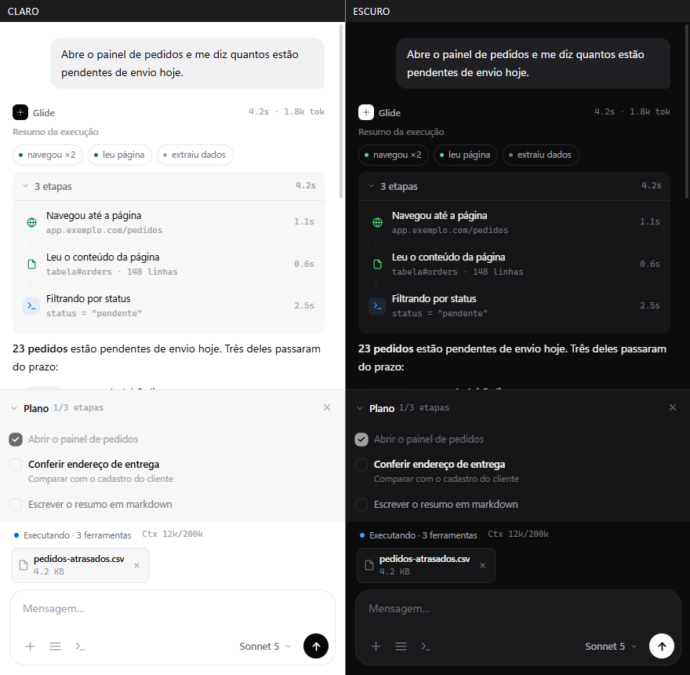
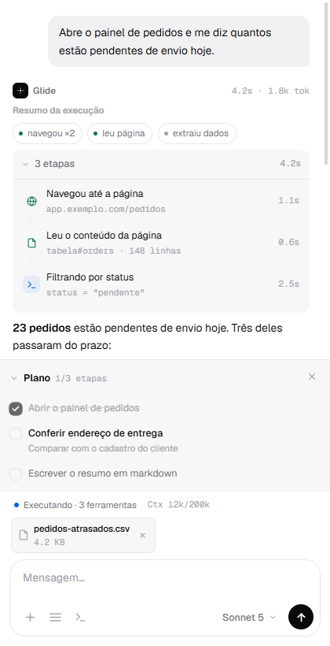
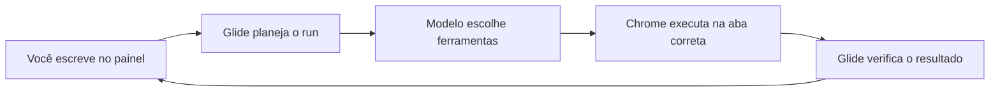

<div align="center">
  
  <h1>Glide</h1>
  <p><strong>Diga o que precisa. Acompanhe cada ação.</strong></p>
  <p>
    Um agente de navegador com IA no painel lateral do Chrome.<br />
    Ele navega, lê, preenche, coleta e organiza — sem esconder o que está fazendo.
  </p>
  <p>
    <a href="#instalação-local"><strong>Instalar localmente</strong></a>
    ·
    <a href="#veja-o-glide-em-ação">Ver a interface</a>
    ·
    <a href="docs/ARCHITECTURE.md">Entender a arquitetura</a>
  </p>
  <p>
    <a href="https://github.com/Emansecio/Glide/actions/workflows/ci.yml"></a>
    
    
    <a href="LICENSE"></a>
  </p>
</div>

<p align="center">
  
</p>

> [!NOTE]
> O Glide está disponível para instalação local e ainda não foi publicado na Chrome Web Store.

## O que você pode pedir

Glide transforma instruções comuns em trabalho observável no navegador.

| Você pede | Glide trabalha |
| --- | --- |
| “Abra o painel de pedidos e me diga quantos envios estão atrasados.” | Navega, lê a página, filtra os dados e entrega o resumo. |
| “Preencha este formulário com os dados da aba anterior, mas pare antes de enviar.” | Cruza abas, preenche campos e mantém a confirmação final com você. |
| “Compare estes produtos e organize preço, prazo e avaliação em uma tabela.” | Visita páginas, extrai informações e estrutura o resultado. |
| “Encontre os erros desta tela e mostre as requisições que falharam.” | Lê console, rede e estado da página sem exigir DevTools. |

Você continua na mesma aba. O plano, as ações e os resultados aparecem no painel lateral enquanto a execução acontece.

## Veja o Glide em ação

<p align="center">
  
</p>

Uma execução reúne três camadas no mesmo lugar:

1. **Resposta** — o resultado em linguagem clara.
2. **Atividade** — cada navegação, leitura e transformação com duração e estado.
3. **Plano** — o que já terminou, o que está acontecendo e o que falta.

Nada vira uma caixa-preta. Você pode interromper uma execução pelo botão de parada ou com `Esc`.

## Automação sob controle

| Visível por padrão | Cauteloso com efeitos | Pronto para trabalho longo |
| --- | --- | --- |
| Ações, ferramentas e resultados aparecem durante a execução. | Se o Chrome interromper uma ação, Glide pede confirmação antes de tentar novamente. | Histórico e retomada segura ajudam em tarefas maiores. |

Glide também oferece:

- referências estáveis para evitar ações em elementos que mudaram;
- suporte a páginas, diálogos, iframes e shadow DOM;
- preenchimento de formulários, seleção de opções e upload de arquivos;
- extração de tabelas, busca na página e coleta com scroll infinito;
- screenshots, downloads, rede, console e métricas de performance;
- automação entre várias abas sem mover o painel da aba onde você o abriu;
- permissões separadas por categoria: leitura, interação, navegação, abas, screenshots, dados sensíveis, área de transferência, upload de arquivos, scripts e downloads (dados sensíveis, área de transferência, upload, scripts e downloads são opt-in).

## Escolha onde a IA roda

Use um provedor em nuvem ou mantenha o modelo na sua máquina:

- **Anthropic / Claude**
- **Codex / OpenAI**
- **OpenCode**
- **Command Code**
- **Qwen / ModelStudio**
- **xAI / Grok**
- **Ollama local**

Credenciais ficam separadas por provedor. Trocar de modelo não reutiliza a chave de outro serviço.

## Instalação local

### 1. Prepare o projeto

Requer Node.js 20.19+ (o CI usa Node 22) e Chrome, Edge ou outro navegador baseado em Chromium.

```bash
git clone https://github.com/Emansecio/Glide.git
cd Glide
npm install
npm run build
```

### 2. Carregue a extensão

1. Abra `chrome://extensions/`.
2. Ative **Modo do desenvolvedor**.
3. Clique em **Carregar sem compactação**.
4. Selecione a pasta `dist/`.

### 3. Escolha o provedor

Abra **Configurações** no painel, selecione um provedor e informe a credencial ou endpoint necessário. Instalações locais mantêm configurações isoladas pelo ID da extensão.

## Como funciona



O service worker coordena modelo, permissões, abas e ferramentas. Operações DOM usam um bridge por padrão; CDP está sempre disponível para interações nativas (a permissão `debugger` do manifest é usada pela ferramenta `cdp`; a flag `toolPermissions.debugger` é ignorada).

Cada efeito recebe uma identidade própria. Se o Chrome interromper o worker entre despacho e confirmação, Glide registra a ação como ambígua e pede uma decisão — nunca repete automaticamente um efeito que pode já ter acontecido.

## Privacidade e segurança operacional

- Telemetria fica local, limitada e sem prompts, credenciais, texto digitado, screenshots ou corpos de página.
- Requisições HTTP feitas pela ferramenta bloqueiam hosts privados e endpoints de metadata.
- Uma allowlist opcional restringe os domínios disponíveis para automação.
- Screenshots podem usar retenção efêmera, curta para debug ou persistente.
- CDP fica sempre disponível para casos difíceis (mostra o banner de depuração do Chrome na aba); o caminho padrão continua sendo APIs da extensão e scripts isolados.

<details>
<summary><strong>Desenvolvimento e verificação</strong></summary>

```bash
npm run check             # TypeScript + Biome
npm run test:frontier     # build + unitários + validator + E2E + evals
npm run test:evals        # avaliações determinísticas locais
npm run test:evals:live   # opcional; requer GLIDE_LIVE_TESTS=1
npm run check:budgets     # bundles e schemas sob limites definidos
npm run preview           # interface estática com dados de demonstração
```

As avaliações determinísticas usam fixtures locais e fazem parte do gate principal. A suíte live acessa apenas páginas públicas para navegação e leitura, não faz login nem mutações e permanece fora do CI.

O preview usa templates e estilos reais:

- `dist/sidepanel/preview.html?theme=light|dark&view=chat|empty|sidebar|settings|history|menu`
- `dist/sidepanel/preview-split.html`

</details>

<details>
<summary><strong>Arquitetura e contratos</strong></summary>

Glide é uma extensão Chrome Manifest V3 em TypeScript e CSS vanilla. A interface vive no painel lateral; o service worker coordena runs; módulos de IA adaptam provedores; ferramentas encapsulam navegador, DOM, rede e arquivos.

Contratos centrais:

- um despacho para cada efeito aceito;
- nenhuma repetição automática de ação ambígua;
- handles obsoletos falham fechados;
- um commit de contexto versionado por turno terminal;
- motivos terminais explícitos para conclusão, parada, interrupção e ambiguidade;
- estado de runtime e telemetria com retenção limitada.

Armazenamento anterior ao programa de resiliência migra sem reset de configurações, sessões, planos, credenciais por provedor ou propriedade tab-scoped do painel.

Documentação:

- [Sistema visual](DESIGN.md)
- [Arquitetura](docs/ARCHITECTURE.md)
- [API de ferramentas e mensagens](docs/API.md)
- [Como contribuir](CONTRIBUTING.md)
- [Changelog](CHANGELOG.md)

</details>

## Roadmap

- simplificar instalação e atualização local;
- ampliar avaliações opcionais em páginas reais;
- preparar políticas e empacotamento para uma futura publicação na Chrome Web Store.

## Contribuição

Issues e pull requests são bem-vindos. Antes de enviar mudanças, consulte o [guia de contribuição](CONTRIBUTING.md) e execute o gate de desenvolvimento.

## Licença

Distribuído sob a [licença MIT](LICENSE).

<p align="center"><strong>Automação poderosa não precisa ser invisível.</strong></p>
