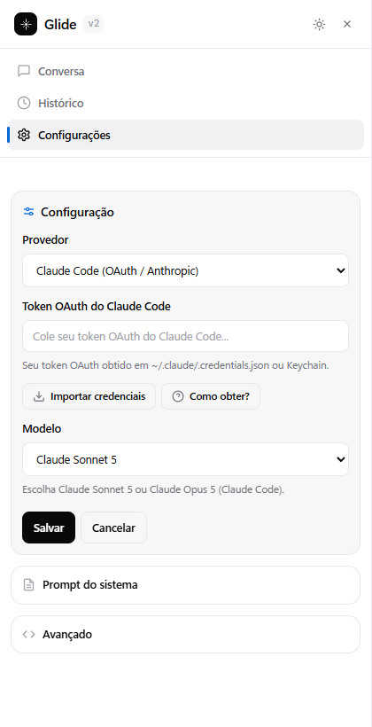
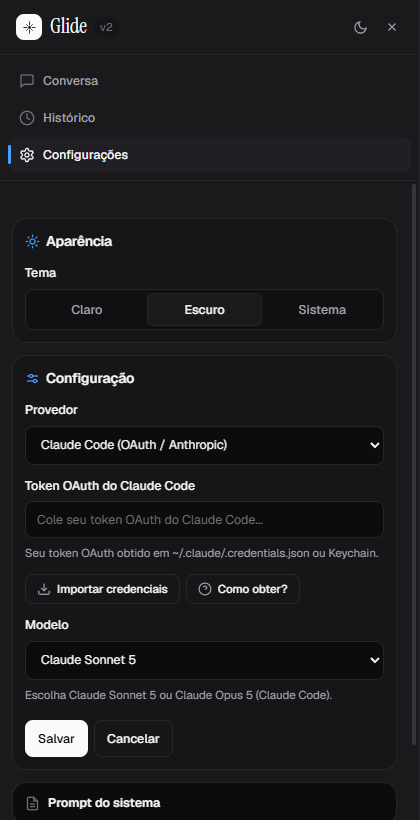
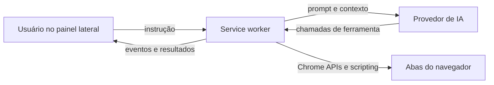

# Glide

> Automação de navegador assistida por IA, direto no painel lateral do Chrome.

O Glide transforma instruções em linguagem natural em ações observáveis no navegador: navegar, ler páginas, interagir com elementos, coletar dados e trabalhar com várias abas mantendo o usuário no controle.

**Estado atual:** projeto local em desenvolvimento. A extensão ainda não está publicada na Chrome Web Store.


## Por que Glide?

Em vez de alternar entre scripts, DevTools e várias ferramentas, você conversa com um agente no painel lateral. Cada ação aparece em uma linha do tempo de atividade, com contexto, resultado e possibilidade de interromper a execução.

## O que ele faz

- Navega por URLs e histórico do navegador.
- Abre, seleciona, agrupa e fecha abas de trabalho.
- Encontra e interage com botões, links, formulários, diálogos e iframes.
- Lê páginas, extrai tabelas, pesquisa texto e coleta listas com scroll infinito.
- Captura screenshots, downloads, rede, console e métricas de performance.
- Executa scripts no contexto isolado da extensão quando necessário.
- Mantém histórico de sessões e reduz automaticamente contextos longos.
- Permite escolher entre Anthropic/Claude, Codex/OpenAI, OpenCode, Command Code e Ollama local.

## Interface

| Tema claro | Tema escuro |
| --- | --- |
|  |  |

A interface V2 foi desenhada para priorizar contraste, espaço e legibilidade. O painel inclui composer compacto, seletor de modelo, atividade de ferramentas, histórico e três modos de tema.

## Como funciona



O modelo decide a próxima ferramenta; o service worker valida permissões, executa a ação na aba correta e devolve o resultado ao painel. A sessão permanece visível e interrompível durante todo o fluxo.

## Contratos de execução

- Cada efeito aceito recebe `actionId` e é despachado uma vez; efeito ambíguo após reinício pausa para confirmação e nunca é repetido automaticamente.
- Operações DOM usam bridge por padrão e um `frameId` explícito. CDP continua opcional e exige permissão de debugger.
- Handles estáveis falham fechados quando snapshot, frame, fingerprint ou revisão ficam obsoletos. Seletores e refs antigos continuam aceitos.
- Cada turno terminal produz um commit de contexto versionado e um motivo terminal explícito.
- Telemetria local mantém no máximo 200 eventos sem argumentos, texto digitado, prompts, credenciais, screenshots, corpos de resultado ou query de URL.

Armazenamento criado antes destes contratos (baseline `82772fc`) migra sem reset: configurações, sessões, planos, slots de provedor e propriedade tab-scoped do painel são preservados. Eventos sintéticos do bridge não são anunciados como input nativo confiável; isso exige CDP opt-in.

## Segurança por padrão

- Permissões de ferramentas separadas por categoria: leitura, interação, navegação, abas e screenshots.
- Allowlist opcional de domínios.
- Validação de URLs com proteção contra hosts privados e metadata endpoints.
- Credenciais armazenadas por provedor, sem reutilizar a chave de outro provedor.
- Botão de parada e `Esc` para interromper uma execução ativa.
- Retenção de screenshots configurável (`ephemeral`, `debug-short` ou `persistent`).

## Instalação local

### Requisitos

- Node.js 18 ou superior.
- Chrome, Edge ou outro navegador baseado em Chromium.

### Build

```bash
npm install
npm run build
```

Depois, abra `chrome://extensions/`, ative **Developer mode**, escolha **Load unpacked** e selecione a pasta `dist/`.

As credenciais e configurações da extensão carregada localmente ficam isoladas pelo ID da instalação. Configure o provedor em **Configurações** antes do primeiro run.

## Desenvolvimento e verificação

```bash
npm run check             # TypeScript + Biome
npm run test:unit         # suíte unitária
npm run test:evals        # avaliações determinísticas locais
npm run test:evals:live   # skip por padrão; requer GLIDE_LIVE_TESTS=1
npm run validate          # validação do pacote da extensão
npm run preview           # preview estático da interface
```

`test:evals` usa fixtures locais, é determinístico e integra o gate de desenvolvimento. `test:evals:live` acessa somente páginas públicas estáveis para navegação/leitura, não faz login nem mutações e fica fora do CI. Para executar: `GLIDE_LIVE_TESTS=1 npm run test:evals:live` (PowerShell: `$env:GLIDE_LIVE_TESTS='1'; npm run test:evals:live`). Falhas de rede ou mudanças nos sites retornam status não zero.

O preview usa os templates e estilos reais:

- `dist/sidepanel/preview.html?theme=light|dark&view=chat|empty|sidebar|settings|history|menu`
- `dist/sidepanel/preview-split.html`

## Arquitetura

- `background.ts` — execução de runs, provedores e ciclo de ferramentas.
- `tools/` — navegação, DOM, rede, screenshots, downloads e abas.
- `sidepanel/` — interface, templates, estilos e estado da sessão.
- `ai/` — adapters de modelos, autenticação, retries e compaction.
- `types/` — contratos compartilhados entre painel e service worker.
- `tests/` — testes unitários, integração, E2E e validação do pacote.

Documentação complementar:

- [Design visual](DESIGN.md)
- [Arquitetura](docs/ARCHITECTURE.md)
- [API de ferramentas e mensagens](docs/API.md)
- [Contribuição](CONTRIBUTING.md)
- [Changelog](CHANGELOG.md)

## Roadmap público

- Consolidar a experiência de instalação local e atualização.
- Expandir os fluxos de teste em páginas reais.
- Preparar materiais, políticas e empacotamento necessários para uma futura publicação na Chrome Web Store.

## Licença

MIT
