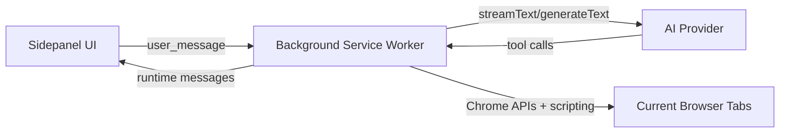

# Glide

Glide is a Chrome extension for AI-assisted browser automation.  
It combines a sidepanel chat UI with browser tools (navigation, DOM interaction, content extraction, screenshots) through a background service worker.

## What Glide Does

- Tool-driven browser automation from chat
- Streaming assistant responses with tool timeline and reasoning channel
- Multi-profile setup (main, vision, orchestrator, auxiliary)
- Session history with context compaction
- Provider support: OpenAI, Anthropic, Google (Gemini), Ollama, Kimi, custom OpenAI-compatible APIs
- Refined sidepanel composer flow:
  - context tools (files/tabs) above prompt input
  - compact activity toggle icon
  - model picker + send action grouped on the right
- Activity panel rendered in normal layout flow (no chat overlap)
- Mobile tab selector bottom-sheet layout under `480px`

## Current Architecture



Main code areas:

- `background.ts`: orchestration, provider calls, tool execution pipeline
- `tools/browser-tools.ts`: browser tool implementations
- `sidepanel/`: UI, templates, styles
- `ai/`: model adapters, message schema, retries, context compaction
- `types/`: shared runtime types
- `tests/`: validator, unit, e2e runners

## Build And Run

Prerequisites:

- Node.js 18+
- Chromium-based browser (Chrome/Edge)

Install:

```bash
npm install
```

Build extension bundle only:

```bash
npm run build
# same as:
npm run build:ext
```

Build test bundles:

```bash
npm run build:test
```

Load extension in Chrome:

1. Open `chrome://extensions/`
2. Enable `Developer mode`
3. Click `Load unpacked`
4. Select `dist/`

## Scripts

| Command | Purpose |
| --- | --- |
| `npm run build` | Build extension artifacts only |
| `npm run build:ext` | Build extension artifacts only |
| `npm run build:test` | Build test runners in `dist/tests/` |
| `npm run validate` | Build ext + tests and run extension validator |
| `npm run test` | Build ext + tests and run validator + unit tests |
| `npm run test:unit` | Build ext + tests and run unit tests |
| `npm run test:e2e` | Build ext + tests and run e2e runner |
| `npm run typecheck` | TypeScript checks only |
| `npm run lint` | Biome checks |
| `npm run lint:fix` | Biome autofix |
| `npm run format` | Biome formatter |

## Provider Notes

- `ollama` defaults to `http://localhost:11434`
- `kimi` defaults to `https://api.kimi.com/coding`
- `google` uses Google Generative AI provider credentials (`apiKey` + model id)
- `custom` expects an OpenAI-compatible base URL

## Security And Safety Defaults

- Tool execution permission gates (`read`, `interact`, `navigate`, `tabs`, `screenshots`)
- Optional domain allowlist for tool execution
- `execute_tool` now uses the same permission pipeline as normal runs
- Screenshot payload retention modes (`ephemeral`, `debug-short`, `persistent`)
- Markdown URL hardening:
  - links allow only `http`, `https`, `mailto`
  - images allow only `http`, `https`

## Docs Index

- `docs/API.md` - runtime message and tool API reference
- `docs/ARCHITECTURE.md` - architecture and data flow
- `CONTRIBUTING.md` - contribution workflow
- `CHANGELOG.md` - release history

## License

MIT
