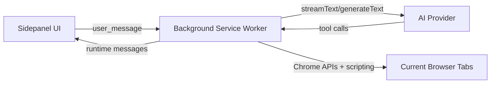

# Glide V2

> **Este é o fork de interface.** A V1 estável vive em `../Glide` e não é tocada
> por nada aqui. As duas se instalam lado a lado no Chrome (`manifest.name` é
> "Glide V2"), então dá para comparar sem desinstalar a estável.
>
> O que a V2 muda: tema claro + escuro, paleta branco/azul/preto-cinza,
> composer de uma linha e uma camada de movimento. Backend, tools e providers
> são idênticos. Ver [DESIGN.md](DESIGN.md).
>
> Para iterar na UI sem recarregar a extensão: `npm run preview`.

Glide is a Chrome extension for AI-assisted browser automation.  
It combines a sidepanel chat UI with browser tools (navigation, DOM interaction, content extraction, screenshots) through a background service worker.

## What Glide Does

- Tool-driven browser automation from chat
- Streaming assistant responses with tool timeline and reasoning channel
- Multi-profile setup (main, vision, orchestrator, auxiliary)
- Session history with context compaction
- Provider support: Claude Code/Anthropic, Codex/OpenAI, OpenCode Zen, and Ollama
- Composer de uma linha (V2):
  - anexo, menu e atividade agrupados à esquerda
  - seletor de modelo + enviar à direita
  - estado do run numa linha própria acima do composer (não trunca mais)
- Tema claro/escuro com três modos (sistema, claro, escuro)
- Activity panel rendered in normal layout flow (no chat overlap)

## Current Architecture



Main code areas:

- `background.ts`: orchestration, provider calls, tool execution pipeline
- `tools/browser-tools.ts`: browser tool implementations
- `sidepanel/`: UI, templates, styles
- `ai/`: model adapters, message schema, retries, context compaction
- `types/`: shared runtime types
- `tests/`: validator, unit, e2e runners
- `fonts/`, `icons/`: tipografia empacotada e o mark (V2)

## O que a V2 muda

Camada visual, estrutura do composer e movimento. Backend, tools e providers são
os mesmos da V1. O sistema completo — tokens, curvas, tipografia, mark e as
medições de desempenho — está em [DESIGN.md](DESIGN.md).

- **Branco, azul e preto/cinza**, claro e escuro. Cada token de cor é um
  `light-dark(claro, escuro)`; trocar de tema é trocar `color-scheme` no `:root`.
  Padrão claro; ciclo claro → escuro → sistema, no ícone da gaveta ou em
  Configurações → Aparência.
- **Tipografia empacotada**: Geist na interface, Instrument Serif nos títulos
  grandes, Geist Mono em dado técnico. 113 KB no pacote — a CSP da extensão
  bloqueia webfont remota.
- **Composer numa linha**: o estado do run virou uma linha própria acima da caixa,
  com a largura inteira do painel, em vez de disputar ~150px com o seletor de
  modelo.
- **Movimento**: entrada de mensagens em cascata, shimmer no rótulo de execução,
  halo pulsante no ponto de status — tudo em `transform`/`opacity` e sob
  `prefers-reduced-motion`.
- **Desempenho**: durante o streaming, os frames acima de 20 ms caíram de 29–30
  (em 60) para zero. Ver [DESIGN.md](DESIGN.md#desempenho).

### Rodar as duas lado a lado

`manifest.name` é "Glide V2", então ela convive com a V1 em `chrome://extensions`
sem conflito — dá para comparar sem desinstalar a estável.

Uma consequência importante: extensão descompactada recebe um ID derivado do
**caminho da pasta**, e `chrome.storage` é por ID. Ou seja, a V2 tem storage
próprio — **credenciais, configurações e histórico não vêm da V1**. Na primeira
vez é preciso reconectar o provedor em Configurações. O outro lado da moeda é
bom: testar na V2 não encosta no histórico da versão estável.

## Build And Run

Prerequisites:

- Node.js 18+
- Chromium-based browser (Chrome/Edge)

Install:

```bash
npm install
```

Build extension bundle only:

```bash
npm run build
# same as:
npm run build:ext
```

Build test bundles:

```bash
npm run build:test
```

Load extension in Chrome:

1. Open `chrome://extensions/`
2. Enable `Developer mode`
3. Click `Load unpacked`
4. Select `dist/`

## Scripts

| Command | Purpose |
| --- | --- |
| `npm run build` | Build extension artifacts only |
| `npm run build:ext` | Build extension artifacts only |
| `npm run build:test` | Build test runners in `dist/tests/` |
| `npm run validate` | Build ext + tests and run extension validator |
| `npm run test` | Build ext + tests and run validator + unit tests |
| `npm run test:unit` | Build ext + tests and run unit tests |
| `npm run test:e2e` | Build ext + tests and run e2e runner |
| `npm run typecheck` | TypeScript checks only |
| `npm run check` | `typecheck` + `lint` — o gate antes de entregar |
| `npm run lint` | Biome checks |
| `npm run lint:fix` | Biome autofix |
| `npm run format` | Biome formatter |
| `npm run preview` | Preview estático da UI em `dist/sidepanel/preview.html` (V2) |
| `npm run icons` | Regenera `icon16/48/128.png` a partir de `icons/glide-logo.svg` (V2) |

### Preview da interface

`npm run preview` costura os templates reais com o CSS real numa página estática
com conteúdo falso — dá para ajustar CSS sem recarregar a extensão no Chrome.

- `dist/sidepanel/preview.html?theme=light|dark&view=chat|empty|sidebar|settings|history|menu`
- `dist/sidepanel/preview-split.html` — claro e escuro lado a lado

## Provider Notes

- `anthropic` uses Claude Code OAuth credentials
- `codex` supports Codex/OpenAI authentication
- `opencode` uses the OpenCode Zen OpenAI-compatible endpoint; Kimi is available as a model preset through this provider
- `ollama` is local and defaults to `http://localhost:11434`

## Security And Safety Defaults

- Tool execution permission gates (`read`, `interact`, `navigate`, `tabs`, `screenshots`)
- Optional domain allowlist for tool execution
- `execute_tool` now uses the same permission pipeline as normal runs
- Screenshot payload retention modes (`ephemeral`, `debug-short`, `persistent`)
- Markdown URL hardening:
  - links allow only `http`, `https`, `mailto`
  - images allow only `http`, `https`

## Docs Index

- `DESIGN.md` — sistema visual da V2: tokens, curvas, movimento, tipografia,
  foco, mark, desempenho medido e o que foi descartado em cada decisão
- `AGENTS.md` — notas de harness: build, gate de verificação, regras da UI,
  controle de run, credenciais, o que não reintroduzir
- `docs/ARCHITECTURE.md` — arquitetura e fluxo de dados
- `docs/API.md` — referência de tools e mensagens de runtime
- `CONTRIBUTING.md` — fluxo de contribuição
- `CHANGELOG.md` — histórico de versões

## License

MIT
